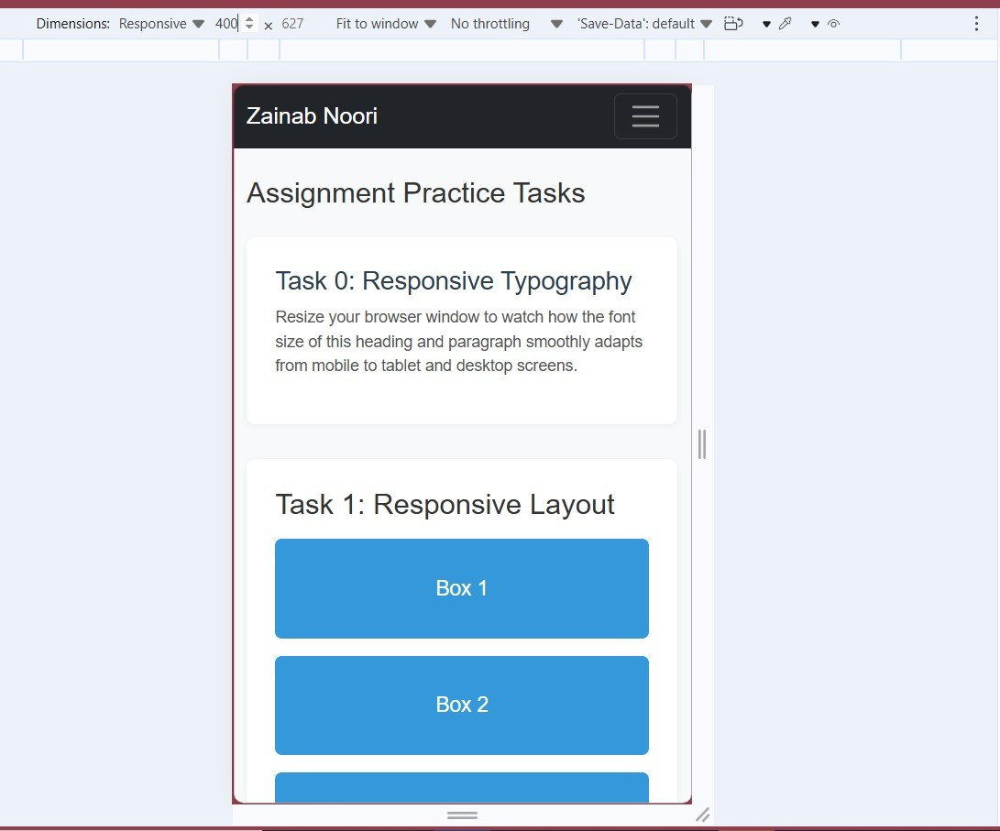
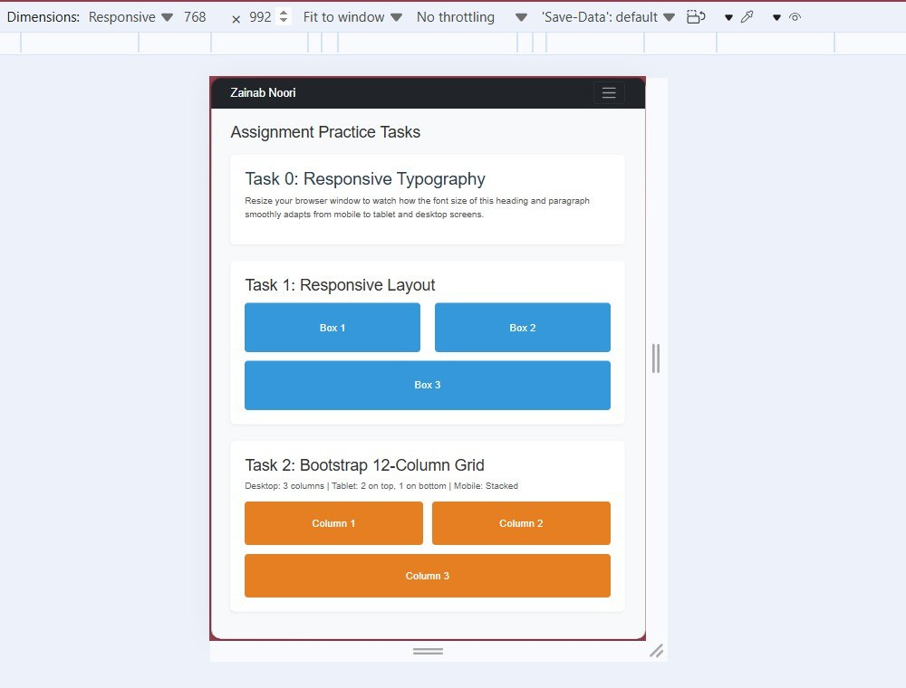
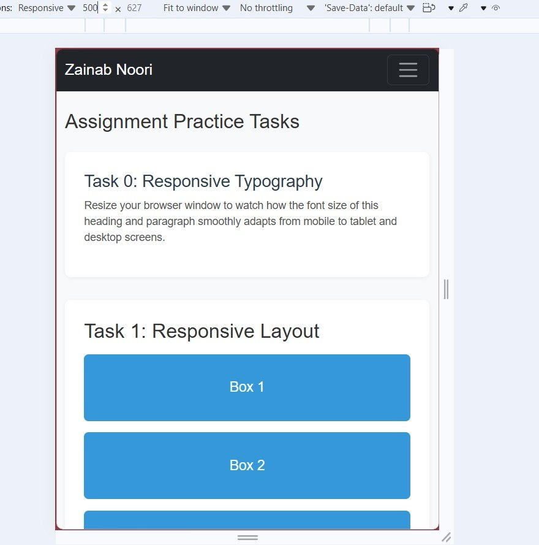
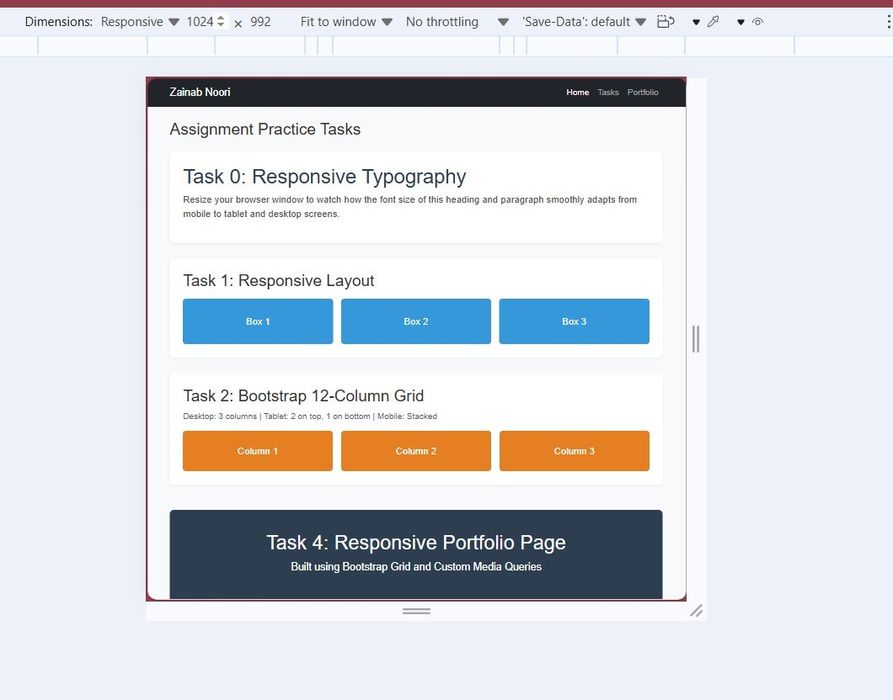

Assignment-3-web: Responsive Web Design Report

This repository contains the completed tasks for the Web Design coursework at Astana IT University. The project demonstrates core principles of modern web development, including responsive typography, flexible layouts, CSS grid frameworks, and adaptive portfolio sections built using CSS media queries.

Student Information
Name: Zainab Noori
Course:Computer Science (IT)
University:Astana IT University

 Project Overview & Implementation Tasks

Task 0: Responsive Typography
Objective: Implement fluid typography that scales smoothly across mobile, tablet, and desktop viewports.
Implementation: Utilized relative CSS units and media queries to adapt heading and paragraph sizes dynamically.
  

Task 1: Responsive Layout
Objective: Design flexible content containers that reorganize based on screen width changes.
Implementation: Applied flexible box models to restructure box containers for smaller and larger screens.

  

 Task 2: Bootstrap 12-Column Grid
Objective: Structure content using a multi-column grid framework.
Implementation:Configured column spans that adapt from stacked mobile views to multi-column desktop layouts.

  

Task 3: Portfolio Section
Objective: Build modular portfolio components with custom alignment and styling rules.
Implementation: Styled distinct portfolio content blocks to enhance user interface hierarchy.

  

Task 4: Responsive Portfolio Page
Objective: Deliver a complete responsive portfolio view integrating all prior layout components.
Implementation:Integrated grid components with custom media queries tailored for larger screens (1024px+).

  

 Conclusion
This assignment successfully validates responsive design concepts, ensuring cross-device compatibility and clean structural organization.
